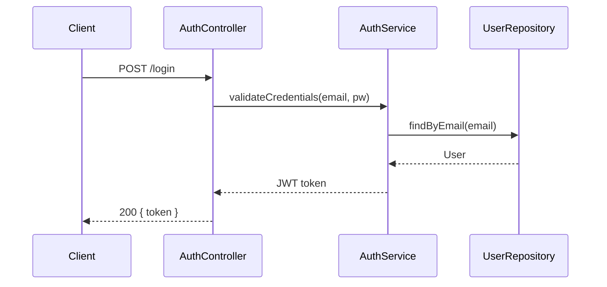

# Burkut

> Structured spec-driven development for any AI coding agent

[](https://www.npmjs.com/package/@burkut/mcp)
[](LICENSE)
[](package.json)

Burkut is an [MCP](https://modelcontextprotocol.io) server for structured spec-driven development. Instead of asking an AI agent to build a feature all at once, Burkut guides it through three planning phases — **requirements → design → tasks** — with human review between each step. Only then does implementation begin, one task at a time.

It works with any MCP-compatible agent: Claude Code, Cursor, OpenCode, Windsurf, VS Code Copilot, Gemini CLI, and more.

Named after **Burkut** (Bürküt) — the divine eagle of Turkic and Altai mythology, perched atop the Tree of Life.

---

## Why spec-driven development?

When you describe a feature to an AI agent and say "build it", the agent starts writing code immediately. It makes assumptions, skips edge cases, and produces something that may not match what you actually wanted.

Burkut changes this by inserting a structured planning step first:

1. **Requirements** — What exactly needs to be built? What are the acceptance criteria?
2. **Design** — How will it be built? What components, data flows, and technical decisions are involved?
3. **Tasks** — What discrete implementation steps are needed? In what order?

You review and approve each phase before the agent writes a single line of code. The result is code that matches your intent.

---

## How it works

```
User:  "Add user authentication to this project"
         ↓
Agent: burkut_spec_init      → creates .specs/ directory in the project
Agent: burkut_spec_new       → creates spec files for "user-authentication"
         ↓
Agent: generates requirements (EARS notation — structured natural language)
Agent: burkut_spec_plan      → validates + saves requirements.md
Agent: "Here are 5 requirements. Does this look right?"
User:  "Yes, but add password reset support"
Agent: updates content, calls burkut_spec_plan again
User:  "Approved"
         ↓
Agent: generates technical design (components, data flow, sequence diagrams)
Agent: burkut_spec_plan      → validates + saves design.md
Agent: "Here's the design. Approve?"
User:  "Approved"
         ↓
Agent: generates implementation task list (wave-ordered, with dependencies)
Agent: burkut_spec_plan      → validates + saves tasks.md
Agent: "7 tasks across 3 waves. Ready to implement?"
User:  "Go ahead"
         ↓
Agent: implements TASK-001 (writes files, runs tests)
Agent: burkut_spec_implement → marks TASK-001 as done in tasks.md
Agent: implements TASK-002...
Agent: burkut_spec_status    → checks overall progress
```

---

## Install

Add one block to your agent's MCP config. See [per-agent setup](#per-agent-setup) below.

The server runs on demand via `npx` — no global install needed.

---

## Getting Started

### Step 1 — Add Burkut to your agent

Pick your agent from the [per-agent setup](#per-agent-setup) section below and add the config.

### Step 2 — Initialize Burkut in your project

Tell your agent:
```
Initialize Burkut in this project
```

The agent will call `burkut_spec_init`, which creates:
```
.specs/
├── .state.json          ← tracks all spec statuses
├── burkut.config.md     ← project context (edit this!)
└── features/            ← your specs live here
```

### Step 3 — Edit burkut.config.md

This is the most important step. The AI reads this file when generating requirements and design. Fill it in with:

```markdown
# Project Context

## Project Name
My SaaS App

## Description
A B2B invoicing platform for freelancers.

## Tech Stack
- Node.js + TypeScript (backend)
- React + Vite (frontend)
- PostgreSQL + Prisma (database)
- Jest (testing)

## Architecture
REST API with a React SPA. Authentication via JWT.
Services are organized by domain (users, invoices, payments).

## Conventions
- Controllers in src/controllers/
- Services in src/services/
- Tests co-located with source files (*.test.ts)
- Use zod for input validation
```

The more context you provide, the better the generated specs will match your codebase.

### Step 4 — Create your first spec

Tell your agent:
```
Create a spec for user authentication — users should be able to register,
log in with email and password, and reset their password via email.
```

The agent will:
1. Call `burkut_spec_new` to create the spec files
2. Generate requirements using EARS notation (see below)
3. Call `burkut_spec_plan` to validate and save them
4. Ask for your review

### Step 5 — Review and iterate

After each phase the agent shows you the generated content and waits for your approval. You can ask for changes:

```
"Add a requirement for rate limiting on the login endpoint"
"The design should use Redis for session storage, not JWT"
"Break TASK-003 into two smaller tasks"
```

The agent regenerates and calls the tool again.

### Step 6 — Implement

Once tasks are approved, the agent implements them one by one, calling `burkut_spec_implement` to update the status in `tasks.md` as it goes.

---

## Spec format explained

### `requirements.md` — EARS notation

Requirements are written in **EARS (Easy Approach to Requirements Syntax)** — a structured natural language format that eliminates ambiguity.

The core pattern is: `WHEN <condition> THE SYSTEM SHALL <behavior>`

```markdown
### REQ-001: User Registration
WHEN a new user submits a valid registration form
THE SYSTEM SHALL create an account and send a verification email

**Acceptance Criteria:**
- [ ] Email must be unique — return 409 if already registered
- [ ] Password must be at least 8 characters
- [ ] Verification email sent within 30 seconds

### REQ-002: Login
WHEN a user submits valid credentials
THE SYSTEM SHALL return a JWT token valid for 7 days

**Acceptance Criteria:**
- [ ] Returns 401 for invalid credentials
- [ ] Returns 429 after 5 failed attempts in 15 minutes
```

Other EARS patterns:
- `THE SYSTEM SHALL ...` — always true (ubiquitous)
- `WHILE <state> THE SYSTEM SHALL ...` — state-driven
- `IF <condition> THEN THE SYSTEM SHALL ...` — conditional

### `design.md` — Technical architecture

The design document captures the technical approach before any code is written. It should include an overview, the main components and their responsibilities, a sequence diagram showing the key flow, and a **Technical Decisions** section listing the important architectural choices and the rationale behind them.

```markdown
## Overview
JWT-based authentication using bcrypt for password hashing
and Nodemailer for transactional email.

## Components

### AuthController
Handles /register, /login, /logout, /password-reset endpoints.

### AuthService
Core business logic — validates credentials, issues tokens,
manages refresh token rotation.

## Sequence Diagram


## Technical Decisions
- HS256 signing for JWT — sufficient for single-service auth
- Bcrypt cost factor 12 — good balance of security and performance
```

### `tasks.md` — Wave-based implementation

Tasks are grouped into **waves** — tasks in the same wave have no dependencies between them and can run in parallel. Wave 2 only starts after all Wave 1 tasks are done.

```markdown
## Wave 1 (parallel)
- [ ] TASK-001: Create User model and database migration
  - Refs: REQ-001
- [ ] TASK-002: Implement bcrypt password hashing utility
  - Refs: REQ-001, REQ-002

## Wave 2 (depends on Wave 1)
- [ ] TASK-003: Build /register endpoint
  - Depends on: TASK-001, TASK-002
  - Refs: REQ-001
- [ ] TASK-004: Build /login endpoint
  - Depends on: TASK-001, TASK-002
  - Refs: REQ-002
```

---

## Tools reference

| Tool | Args | Description |
|------|------|-------------|
| `burkut_spec_init` | `projectName?` | Initialize Burkut in the current project |
| `burkut_spec_new` | `name` | Create a new spec with blank template files |
| `burkut_spec_plan` | `name`, `phase`, `content` | Validate and save one planning phase |
| `burkut_spec_implement` | `name`, `taskId`, `status` | Update a task's implementation status |
| `burkut_spec_status` | — | Show all specs and task progress |
| `burkut_spec_list` | — | List all specs |

### `burkut_spec_plan` in detail

This is the core tool. The agent generates markdown content for a phase, then passes it here for validation and persistence.

```
name:    spec slug (e.g. "user-authentication")
phase:   "requirements" | "design" | "tasks"
content: the markdown the agent generated
```

If the content fails validation (e.g. no `THE SYSTEM SHALL` in requirements, or a task references an unknown dependency), the tool returns the specific errors so the agent can fix and retry.

### `burkut_spec_implement` in detail

The agent implements tasks using its own tools (file editing, running tests, etc.). After completing a task, it calls this tool to update `tasks.md`.

```
name:    spec slug
taskId:  "TASK-001"
status:  "in_progress" | "done" | "skipped"
```

---

## Per-agent setup

### Claude Code (`.mcp.json` in project root)

```json
{
  "mcpServers": {
    "burkut": {
      "command": "npx",
      "args": ["-y", "@burkut/mcp"]
    }
  }
}
```

### Cursor (`.cursor/mcp.json`)

```json
{
  "mcpServers": {
    "burkut": {
      "command": "npx",
      "args": ["-y", "@burkut/mcp"]
    }
  }
}
```

### OpenCode (`opencode.json`)

```json
{
  "mcp": {
    "burkut": {
      "type": "local",
      "command": ["npx", "-y", "@burkut/mcp"]
    }
  }
}
```

### VS Code / GitHub Copilot (`.vscode/mcp.json`)

```json
{
  "servers": {
    "burkut": {
      "command": "npx",
      "args": ["-y", "@burkut/mcp"]
    }
  }
}
```

### Claude Desktop

```json
// ~/Library/Application Support/Claude/claude_desktop_config.json
{
  "mcpServers": {
    "burkut": {
      "command": "npx",
      "args": ["-y", "@burkut/mcp"]
    }
  }
}
```

### Windsurf (`~/.codeium/windsurf/mcp_config.json`)

```json
{
  "mcpServers": {
    "burkut": {
      "command": "npx",
      "args": ["-y", "@burkut/mcp"]
    }
  }
}
```

---

## Packages

| Package | Version | Description |
|---------|---------|-------------|
| [`@burkut/mcp`](packages/mcp) | [](https://www.npmjs.com/package/@burkut/mcp) | MCP server — install this |
| [`@burkut/core`](packages/core) | [](https://www.npmjs.com/package/@burkut/core) | Spec engine (parser, validator, task graph) |

---

## Development

```bash
git clone https://github.com/xbakbal/burkut.git
cd burkut
pnpm install --ignore-scripts
pnpm build
pnpm test
```

### Structure

```
packages/
  core/   → @burkut/core  (spec model, markdown parser, validation, task dependency graph)
  mcp/    → @burkut/mcp   (MCP server exposing 6 spec tools via STDIO transport)
```

---

## About the name

**Burkut** (Bürküt, meaning "eagle" in Old Turkic) is the divine eagle figure from Turkic and Altai mythology. Perched atop the 7th branch of the Tree of Life, Burkut is the emissary of the sky god Ülgen — its copper talons guard the gate between earth and heaven, its right wing veils the sun, and its left wing shelters the moon.

In Sakha (Yakut) culture, the eagle is portrayed on top of the Tree of Earth as the symbol of Tengri. The name Burkut (also known as Merküt, Markut, Semrük) has been revered across Turkic, Altai, and Mongol traditions for millennia as the ultimate guardian spirit and the first teacher of shamans.

---

## License

MIT — see [LICENSE](LICENSE)
